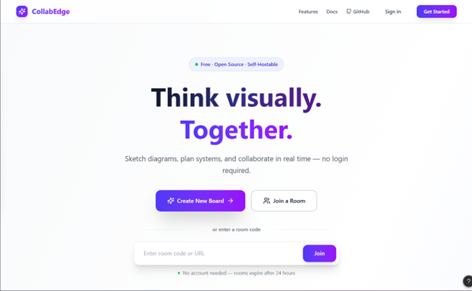
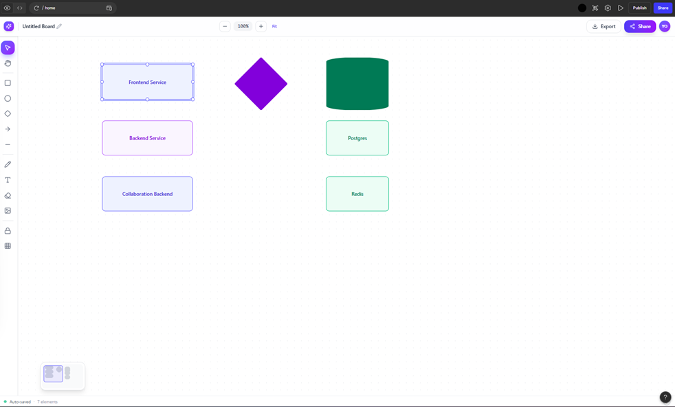
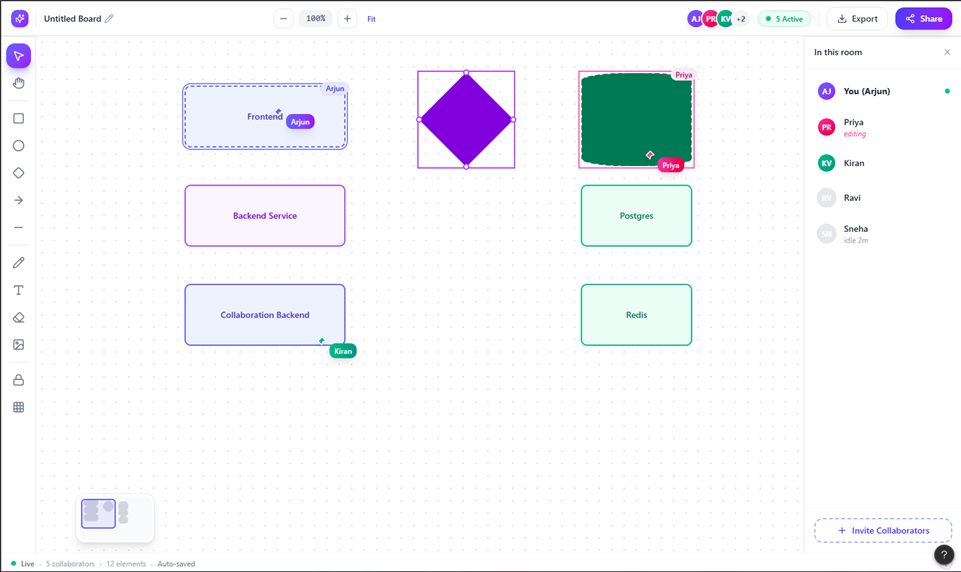
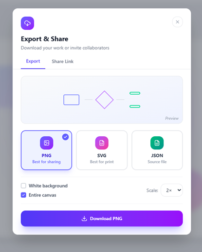
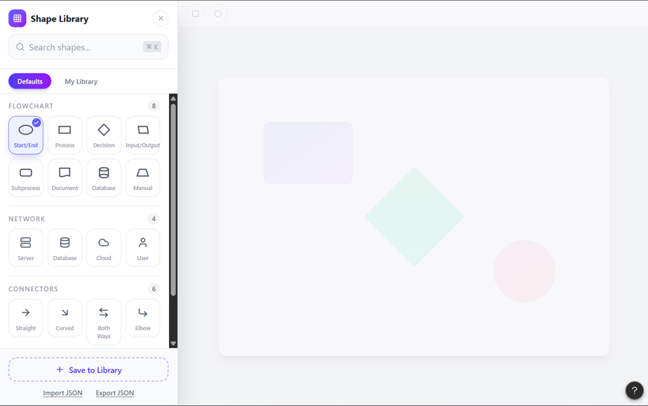

# CollabEdge

<h4 align="center">
  <a href="#">CollabEdge</a> |
  <a href="#">Documentation</a> |
  <a href="#">Features</a>
</h4>

<div align="center">
  <h2>
    A collaborative virtual whiteboard application with AI integration. </br>
    Built on Excalidraw, enhanced for AWS deployment with OpenAI features. </br>
  <br />
  </h2>
</div>

<br />
<p align="center">
  <a href="LICENSE">
    
  </a>
  
  
  
</p>

<div align="center">
  <figure>
    <figcaption>
      <p align="center">
        <strong>CollabEdge</strong> - Create beautiful hand-drawn like diagrams, wireframes, and collaborate in real-time with AI assistance.
      </p>
    </figcaption>
  </figure>
</div>

## Software Design

### Architecture
CollabEdge uses a three-service architecture (Frontend · Backend · Relay)
with a Client-Server + Layered + Event-Driven hybrid style.
All services are containerised with Docker Compose.


### Design Summary
Key design choices:
- **Three-service split** — Relay separated from Backend for independent scaling
- **Offline-first** — IndexedDB as primary write target; server sync is secondary
- **Repository pattern** — all DB access through named repository methods
- **Shared event constants** — single source of truth for WebSocket event names
- **Nginx gateway** — single entry point; services not directly addressable

### Wireframes
Designed in Figma (medium-fidelity, black & white):
| Screen | Preview |
|--------|---------|
| Landing / Room Entry |  |
| Canvas Solo Mode |  |
| Collaboration Mode |  |
| Styling Sidebar |  |
| Export Modal |  |
| Library Panel |  |

> draw.io file (Architecture): https://drive.google.com/file/d/1vZWLs8BdGxQ6ozmbbAdyRYyQaS0DgcN6/view?usp=sharing

### Full Design Document
See [docs/design/CollabEdge_DA2_SoftwareDesign.pdf](docs/design/CollabEdge_DA2_SoftwareDesign.pdf)

## Features

CollabEdge includes all the powerful Excalidraw features plus:

- 💯&nbsp;Free & open-source.
- 🎨&nbsp;Infinite, canvas-based whiteboard.
- ✍️&nbsp;Hand-drawn like style.
- 🌓&nbsp;Dark mode.
- 🏗️&nbsp;Customizable.
- 📷&nbsp;Image support.
- 😀&nbsp;Shape libraries support.
- 🌐&nbsp;Localization (i18n) support.
- 🖼️&nbsp;Export to PNG, SVG & clipboard.
- 💾&nbsp;Open format - export drawings as an `.excalidraw` json file.
- ⚒️&nbsp;Wide range of tools - rectangle, circle, diamond, arrow, line, free-draw, eraser...
- ➡️&nbsp;Arrow-binding & labeled arrows.
- 🔙&nbsp;Undo / Redo.
- 🔍&nbsp;Zoom and panning support.
- 🤖&nbsp;AI-powered diagram generation with OpenAI integration.
- ☁️&nbsp;AWS-ready deployment configuration.

## Additional CollabEdge Features

- 📡&nbsp;PWA support (works offline).
- 🤼&nbsp;Real-time collaboration.
- 🔒&nbsp;End-to-end encryption.
- 💾&nbsp;Local-first support (autosaves to the browser).
- 🔗&nbsp;Shareable links (export to a readonly link you can share with others).

## Quick start

To run CollabEdge locally for development:

1. Install dependencies: `yarn`
2. Configure your OpenAI API key in `.env.local`:
   ```
   VITE_APP_OPENAI_API_KEY=your_api_key_here
   ```
3. Start the development server: `yarn start`
4. Open `http://localhost:3000` in your browser

To embed the editor in another React app, use `@excalidraw/excalidraw` and include its CSS.

For AWS static hosting (S3 + CloudFront), build with `yarn build` and upload the `excalidraw-app/build` directory to an S3 bucket configured for static website hosting. Configure CloudFront to point to that bucket, enable gzip/brotli, and cache HTML with low TTL.

## Contributing

- Found a bug or want to request a feature? [Open an issue](../../issues).
- Want to contribute? Pull requests are welcome!

## Built With

- [Excalidraw](https://excalidraw.com/) - The core drawing engine
- [OpenAI API](https://openai.com/api/) - AI-powered features
- [React](https://reactjs.org/) - Frontend framework
- [TypeScript](https://www.typescriptlang.org/) - Type safety

## Configuration

### Environment Variables

Create a `.env` file in the `excalidraw-app/` directory with the following variables:

```bash
# Hide Plus/SaaS references in the UI (set to "true" to hide)
VITE_HIDE_PLUS_REFERENCES=true

# Plus app URLs (only used if VITE_HIDE_PLUS_REFERENCES is false)
VITE_APP_PLUS_APP=https://app.excalidraw.com
VITE_APP_PLUS_LP=https://plus.excalidraw.com

# Git SHA for version tracking
VITE_APP_GIT_SHA=

# Enable tracking
VITE_APP_ENABLE_TRACKING=false

# Disable live reload in development
VITE_APP_DEV_DISABLE_LIVE_RELOAD=false

# Disable Sentry
VITE_APP_DISABLE_SENTRY=false
```

## Deployment (AWS)

For static hosting via AWS:

1. Build the app: `yarn build` (outputs to `excalidraw-app/build`).
2. Upload contents of `excalidraw-app/build` to an S3 bucket configured for static website hosting.
3. Create a CloudFront distribution pointing to the S3 origin, enable gzip/brotli, default root object `index.html`.
4. Set error responses for 403/404 to `/index.html` with 200 to support SPA routing.
5. Invalidate CloudFront cache on deploys.

For container hosting (Elastic Beanstalk/ECS):

- Build Docker image using included `Dockerfile`. The image serves the built app via Nginx.
- Expose port 80 and map to your service. Ensure health check path `/`.

## License

This project is licensed under the MIT License - see the [LICENSE](LICENSE) file for details.

## Acknowledgments

- Built on the amazing [Excalidraw](https://excalidraw.com/) project
- AI features powered by [OpenAI](https://openai.com/)
- Special thanks to the Excalidraw community for the solid foundation
